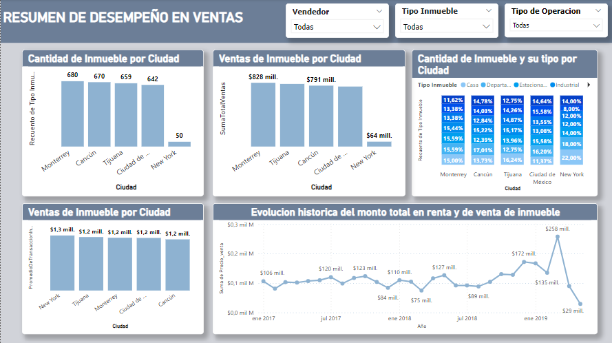
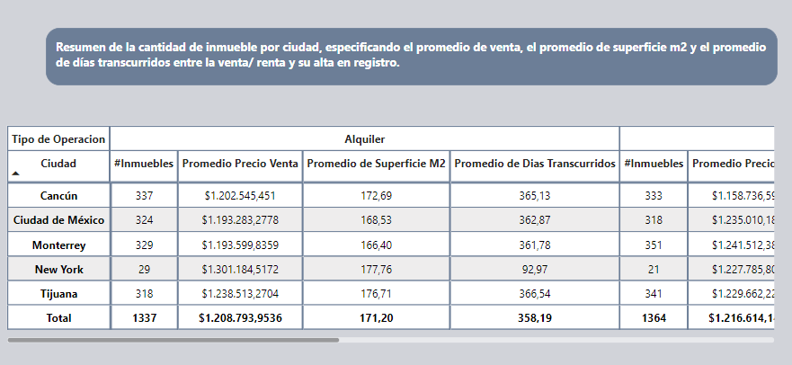

# Informe de desempeño de ventas

### Tenemos gráficos que reflejan la cantidad de inmuebles que hay por ciudad, el total de ventas de inmuebles por ciudad, la cantidad de cada tipo inmuebles que hay por ciudad y la evolución histórica del monto total de inmuebles vendidos y rentados.

# Matriz

